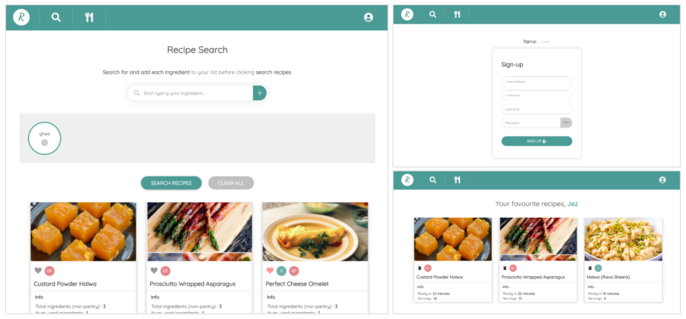

# react-express-recipe-finder

- This project focuses on developing a full-stack web application that allows users to search recipes for their ingredients, signup/login and save their favourites to a personal list.
- The [Spoonacular recipe API](https://rapidapi.com/spoonacular/api/recipe-food-nutrition/details) is used for recipe recommendations.
- `ReactJS` is used for the custom front-end and `Node with ExpressJS` is used for back-end services.
- A `MongoDB` is used to store user credentials and 'favourited' recipes.

## What the app looks like...
<p align="center">

</p>

## Pre-reqs & Dependencies

### /client

- the client was created using `create-react-app` installed globally via npm react -g, to provide a boostrapped project layout
- **Pre-requisites**
  - run `npm i` to install all dependencies, listed in the corresponding `packages.json` file.
  - create a `.env` file within this directory specifying the following:
  ``` bash
  REACT_APP_APIKEY=<APIKEY>
  ```

### /server
- **Pre-requisites**
  - run `npm i` to install all dependencies, listed in the corresponding `packages.json` file.
  - create a `.env` file within this directory specifying the following:
  ``` bash
  JWT_SECRET=<JWTSECRET>
  ```